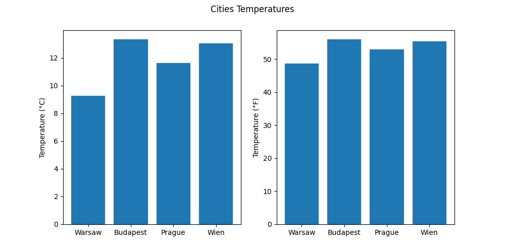

# Custom Weather API

*Note: We get all our raw data from the public OpenWeather API in the background.*

### Getting weather info from OpenWeather:

Gets complete weather info from OpenWeather based on the input latitude and longitude parameters.

**HTTP endpoint:**

```
	http://127.0.0.1:8000/weather/?lat={lat}&lon={lon}
```

**Example request:**

```
    curl http://127.0.0.1:8000/weather/?lon=21.00&lat=52.23
```
**Example response:**
```json
{
    "coord":
    {
        "lon": 21.0038,
        "lat": 52.2265
    },
    "weather":
    [
        {
            "id": 803,
            "main": "Clouds",
            "description": "broken clouds",
            "icon": "04d"
        }
    ],
    "base": "stations",
    "main":
    {
        "temp": 13.25,
        "feels_like": 12.88,
        "temp_min": 11.63,
        "temp_max": 14.32,
        "pressure": 1018,
        "humidity": 86
    },
    "visibility": 10000,
    "wind":
    {
        "speed": 3.6,
        "deg": 300
    },
    "clouds":
    {
        "all": 75
    },
    "dt": 1666795252,
    "sys":
    {
        "type": 2,
        "id": 2032856,
        "country": "PL",
        "sunrise": 1666761600,
        "sunset": 1666797581
    },
    "timezone": 7200,
    "id": 756135,
    "name": "Warsaw",
    "cod": 200
}
```

### Getting a report of a city:

Gets a report of a city which includes:
 - Name of the city
 - Hours till sunset or sunrise (whichever is closer)
 - Temperature in Celsius and Fahrenheit
 - Predicted mood of the people based on cloudiness and temperature
 
You have to call the endpoint with country code and city parameters

*More detail about country codes: https://en.wikipedia.org/wiki/Country_code*

**HTTP endpoint:**

```
	http://127.0.0.1:8000/weather/report/city/?country_code={country_code}&city={city}
```

**Example request:**

```
    curl http://127.0.0.1:8000/weather/report/city/?country_code=HU&city=Budapest
```

**Example response:**
```json
{
    "City": "Budapest",
    "Hours till": "We are closer to sunset(00:43)",
    "Temperature":
    {
        "°C": 16.66,
        "°F": 61.988
    },
    "Mood": "Annoyed"
}
```

### Getting a report of a location:

Gets a report of a location which includes:
 - Name of the closest city
 - Hours till sunset or sunrise (whichever is closer)
 - Temperature in Celsius and Fahrenheit
 - Predicted mood of the people based on cloudiness and temperature
 
You have to call the endpoint with latitude code and longitude parameters


*More detail about country codes: https://en.wikipedia.org/wiki/Country_code*

**HTTP endpoint:**

```
    http://127.0.0.1:8000/weather/report/?lat={lat}&lon={lon}
```
**Example request:**

```
    curl http://127.0.0.1:8000/weather/report/?lon=19.040&lat=47.49
```
**Example response:**
```json
{
    "City": "Budapest",
    "Hours till": "We are closer to sunset(00:43)",
    "Temperature":
    {
        "°C": 16.66,
        "°F": 61.988
    },
    "Mood": "Annoyed"
}
```

### Getting the temperature of a location:

Gets the temperature of a location in Celsius and Fahrenheit based on the input latitude and longitude parameters.

**HTTP endpoint:**

```
	 http://127.0.0.1:8000/weather/report/temp?lon={lon}&lat={lat}
```

**Example request:**

```
    curl http://127.0.0.1:8000/weather/report/temp?lon=19.04&lat=47.49
```

**Example response:**
```json
{
    "Temperature":
    {
        "°C": 16.41,
        "°F": 61.538
    }
}
```

### Getting the hours until sunrise or sunset of a location:

Gets the hours till sunset or sunrise of a location. (Whichever closer.)

**HTTP endpoint:**

```
	 http://127.0.0.1:8000/weather/report/hours_till?lon={lon}&lat={lat}
```

**Example request:**

```
    curl http://127.0.0.1:8000/weather/report/hours_till?lon=19.04&lat=47.49
```

**Example response:**
```json
{
    "Hours till": "We are closer to sunset(00:13)"
}
```

### Getting the predicted mood of the people in a location:

Gives a prediction on peoples moods based on temperature and cloudiness.

**HTTP endpoint:**

```
	 http://127.0.0.1:8000/weather/report/mood?lon={lon}&lat={lat}
```

**Example request:**

```
    curl http://127.0.0.1:8000/weather/report/mood?lon=19.04&lat=47.49
```

**Example response:**
```json
{
    "Mood": "Annoyed"
}
```

### Plotting the temperatures of 4 cities listed bellow:

Creates a plot comparing the weather in the following cities:
- Warsaw
- Budapest
- Prague
- Wien

The plot shows the temperature in Celsius and Fahrenheit also.
Upon request png picture gets downloaded showing the result of the plot.

**HTTP endpoint:**

```
	 http://127.0.0.1:8000/weather/plot/
```

**Example request:**

```
    curl http://127.0.0.1:8000/weather/plot/
```

**Example plot:**


### Getting the latitude and longitude of 4 cities:

Gets the latitude and longitude of these cities:
- Warsaw
- Budapest
- Prague
- Wien

**HTTP endpoint:**

```
	 http://127.0.0.1:8000/city_lat_lon/
```

**Example request:**

```
    curl http://127.0.0.1:8000/city_lat_lon/
```

**Example response:**
```json
[
    {
        "name": "Warsaw",
        "lat": "52.2319581",
        "lon": "21.0067249"
    },
    {
        "name": "Budapest",
        "lat": "47.4979937",
        "lon": "19.0403594"
    },
    {
        "name": "Prague",
        "lat": "50.0874654",
        "lon": "14.4212535"
    },
    {
        "name": "Wien",
        "lat": "48.2083537",
        "lon": "16.3725042"
    }
]
```